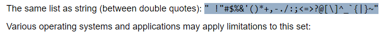

# 03-Challenge_pwGenerator
JavaScript Challenge: Password Generator

# Password Generator Starter Code

User Story

I WANT to randomly generate a password that meets certain criteria

Acceptance Criteria

GIVEN I need a new, secure password
WHEN I click the button to generate a password
THEN I am presented with a series of prompts for password criteria
WHEN prompted for password criteria
THEN I select which criteria to include in the password
WHEN prompted for the length of the password
THEN I choose a length of at least 8 characters and no more than 128 characters
WHEN asked for character types to include in the password
THEN I confirm whether or not to include lowercase, uppercase, numeric, and/or special characters
WHEN I answer each prompt
THEN my input should be validated and at least one character type should be selected
WHEN all prompts are answered
THEN a password is generated that matches the selected criteria
WHEN the password is generated
THEN the password is either displayed in an alert or written to the page

[OWASP.ORG-Reference](https://owasp.org/www-community/password-special-characters)

Had to adjust slightly to function: 
```java
var specialChars = "!@#$%^&*()-_=+[]{}|;:'\",.<>/?`~";
```
Code Reference: [Codepal.ai](https://codepal.ai/code-generator/query/8Qd07kte/password-guessing-code) 
C:\Users\sam\Bootcamp\challenges\03-Challenge_pwGenerator\assets\images\codepal.ai.png

**Changes made: **

#1-Separated Characters to allow user to choose a minimum of one type they would like to use
#2-